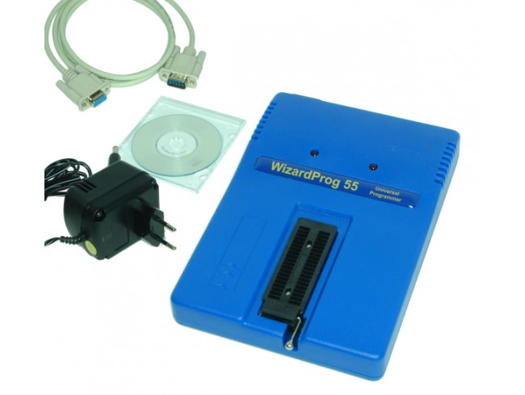

# wizardprog-55-english

English-patched software for the Russian WizardProg-55 (TOP2000B clone) EPROM programmer. Binary-edited from the original Russian version. Tested on Windows XP/10 (32/64-bit) using RS232 Serial via Prolific PL2303-HX USB adapter. A restoration project to keep legacy hardware functional in English.

## Downloads

The following software versions are available in this repository:

- **[WizardProg55.zip](WizardProg55.zip):** Contains the complete installed software folder. Inside, you will find `WizardProg55-en.exe`, which is the English-patched executable.
- **[setup.exe_pass_123.zip](setup.exe_pass_123.zip):** The original Russian installation software. 
  - **Unzip password:** `123`

## The Story Behind This Small Project

In December 2005, during a business trip to Moscow, I purchased a WizardProg-55 programmer. After writing maybe three EPROMs, I left it tucked away for 20 years. In February 2025, I regained interest in retrocomputing projects and found it among my old belongings. Unfortunately, the original software CD had delaminated and was unreadable.

I contacted the still-active [WizardProg](https://www.wizardprog.com) company, and Mr. **Sergey Menylyshev** was kind enough to send me a copy of the original Russian software. Recently, I used [Claude Code](https://claude.com/product/claude-code) to binary-edit the executable (.exe), replacing the original Russian strings with English. Some remaining Chinese text was also translated. Due to the constraints of the original string lengths in the binary, some translations had to be truncated or abbreviated.

During this process, I discovered that the WizardProg-55 is a clone of the Chinese **TOP2000B** programmer, manufactured by **ty51** (`www.ty51.com`) — also known as *Changxing Jinggong Technology Development Company* — which apparently ceased operations around 2012. Various versions of the TOP2000B original software can still be found via the [Wayback Machine](https://web.archive.org/web/sitemap/http://www.ty51.com).

## Hardware Gallery

  
   
  <em>Russian WizardProg-55 Programmer.</em>

  
   
  <em>Chinese TOP2000B Programmer (Original Hardware).</em>

## Technical Notes

- **Compatibility:** Tested on Windows 10 (64-bit) and Windows XP SP3 (32-bit).
- **Interface:** Requires a Serial RS232 connection. Tested successfully with a Prolific PL2303-HX USB adapter.
- **No Drivers Needed:** The software communicates directly via COM port at 115200 bps, so no specific programmer drivers are required, only the driver for your Serial/USB adapter.
